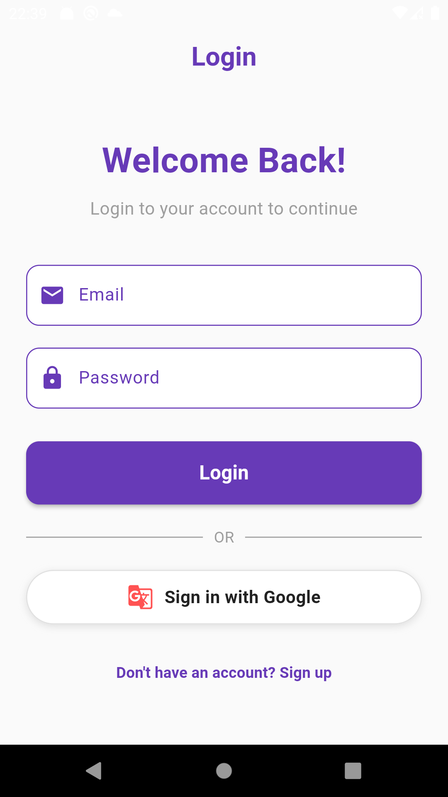
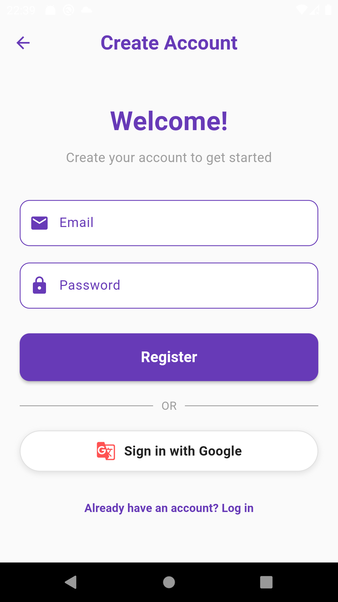

# msoft_app

Este es un proyecto desarrollado en flutter

## Descripción

msoft_app es una aplicación desarrollada en Flutter que incluye autenticación con Auth0, almacenamiento seguro con `flutter_secure_storage`, integración con Google Sign-In y más.

## Estructura del Proyecto

msoft_app/ ├── android/ ├── build/ ├── ios/ ├── lib/ │ ├── main.dart │ ├── presentation/ │ │ ├── auth/ │ │ │ └── screen/ │ │ │ ├── LoginScreen.dart │ │ │ ├── RegisterScreen.dart │ │ └── home/ │ │ └── screens/ │ │ └── HomeScreen.dart │ ├── providers/ │ │ └── AuthProvider.dart │ └── shared/ │ └── widgets/ │ └── checkAuthentication.dart ├── macos/ ├── test/ ├── web/ └── pubspec.yaml

## Instalación

1. Clona el repositorio:
   ```sh
   git clone https://github.com/UpsIE2025/proyectoFinal-g6.git
   ```
2. Navega al directorio del proyecto:
   ```sh
   cd msoft_app
   ```
3. Instala las dependencias:
   ```sh
   flutter pub get
   ```

## Ejecución

Para ejecutar la aplicación en modo debug, usa el siguiente comando:

```sh
flutter run


Dependencias
auth0_flutter: ^1.8.0
flutter_secure_storage: ^9.2.4
google_sign_in: ^6.2.2
shared_preferences: ^2.5.2
provider: ^6.1.2

Estructura de Rutass
/: AuthWrapper
/login: LoginScreen
/home: HomeScreen
/register: RegisterScreen

```

## Pantalla de inicio de sesióm



## Pantalla de registro de cuenta



## Pantalla inicio de sesión con google


## Pantalla de Home


